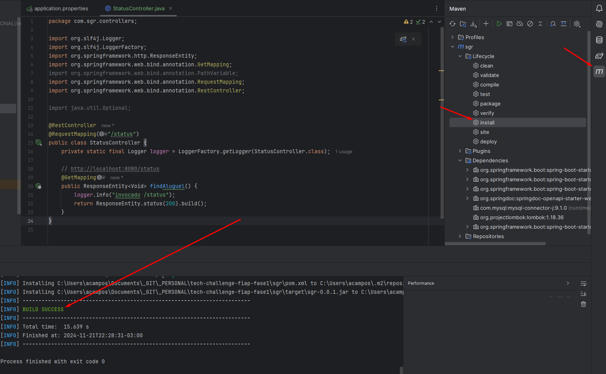
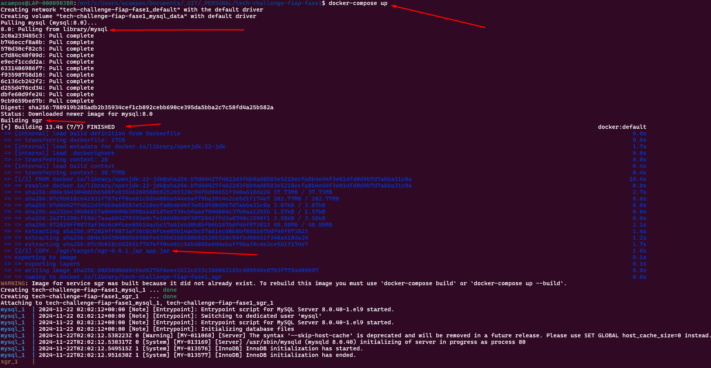
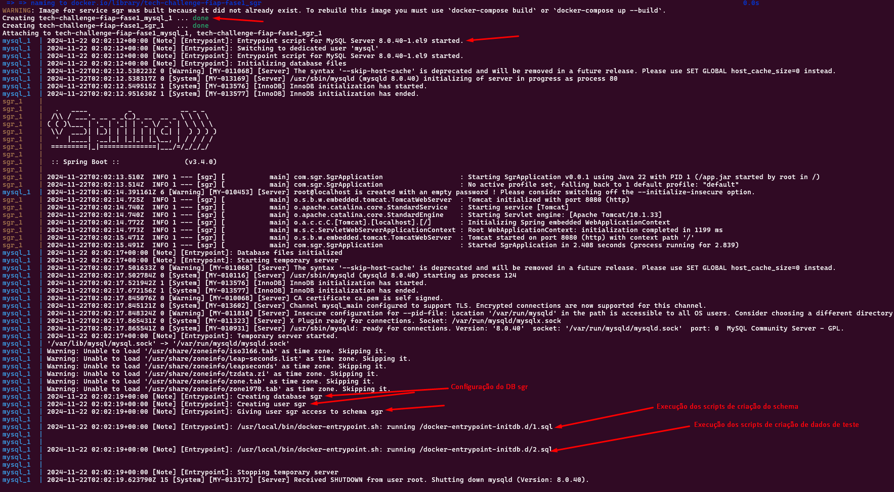
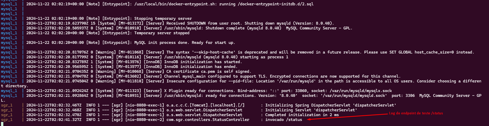
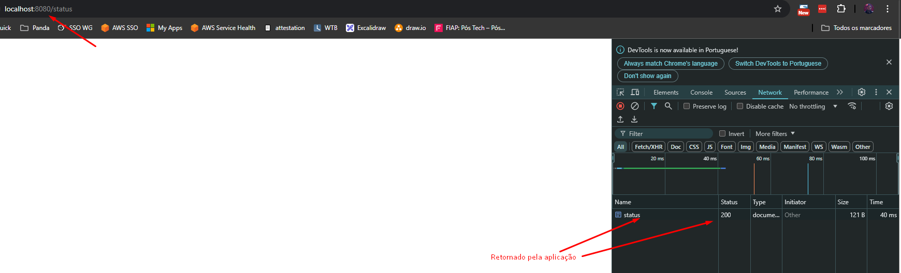

# tech-challenge-fiap-fase1

Projeto de sistema de gestão de restaurantes - SGR, desenvolvido em grupo para a conclusão da primeira fase do curso de pós-graduação de desenvolvimento e arquitetura Java da FIAP.

O projeto é desenvolvido em Java, com o framework Spring MVC e Spring Boot, utilizando banco de dados MySQL. A aplicação será encapsulada em containers Docker, permitindo assim, provisionar todos seus recursos com docker-compose.

O banco utilizado foi o MySQL, utilizando container mysql:8.0. Seu container é criado a partir da imagem base mysql:8.0, e os scripts do diretorio `sql_scripts` são executados em sua inicialização.
- schema.sql -> Cria a estrutura de tabelas do banco.
- data.sql -> Cria alguns usuarios de teste na tabela `usuarios` para teste.

# Compilando a aplicação
Neste momento, a aplicação precisa ser compilada antes de poder ser executada em seus containers Docker.

Para isso, abra o projeto da pasta `sgr` em uma IDE Java e rode a rotina de `install` do maven. No Intellij:

Pelo console execute o comando `mvn clean install`.

Isso irá compilar a aplicação e criar o arquivo `sgr/target/sgr-0.0.1.jar` necessario para build do container da aplicação.

# Comandos para rodar a aplicação

Para iniciar todos os containers e acessar a aplicação: `docker-compose up`.
Por default o arquivo docker-compose.yaml será utilizado. Que faz:

1. Baixa o container padrão do MySQL.
    1. Configura o DB MySQL (usuarios, senhas, etc.).
    1. Cria o banco de dados 'sgr' (tabelas, etc.).
    1. Cria dados de teste na tabela 'usuarios'.
1. Constroi o container da aplicação.
    1. Baixa o container padrao openjdk.
    1. Copia o arquivo da aplicação para dentro do container.
    1. Cria um entrypoint com o comando de execução da aplicação.

## Exemplos:
Execução do comando de inicialização:

Criação e configuração do DB:

Teste da aplicação:

